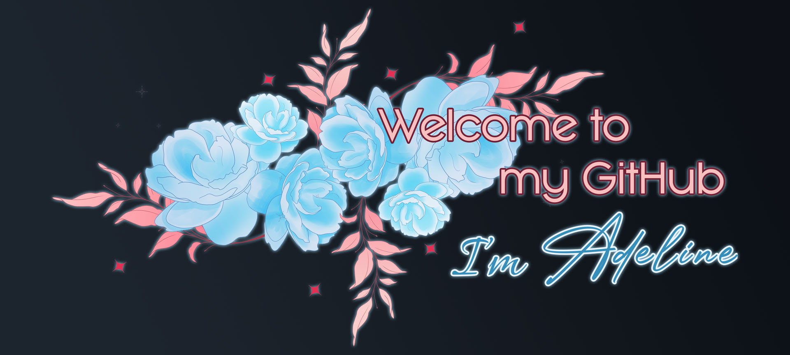

<h1 align='center'> Hello there ! ✨ </h1>

<!--  -->

I'm Adeline and I am a 1st year software development student at <a href="https://www.linkedin.com/school/laplateformeio/">La Plateforme_</a>. I'm curious and a fast learner.

I used to be a nurse, I worked at a hospital for three years.
Although I loved caring for patients, I realised that the healthcare environment was not the right fit for me. 

I’ve always liked tech, with a strong interest in backend and low-level programming. I’m flexible and keen to grow in any role.

<!-- ### 🔗 Links -->
## 💬 Contact me
🌍 Marseille, France

  
  
  

## 🛠️ Hard Skills
### Tools & IDE

### Programming languages

### Databases & Data Handling

### Operating Systems & Virtualization

### Shell & Scripting

### Design Software

*Note: I'm constantly growing these skills — I include tools I’ve used in real-world projects, courses, or personal experimentation.*

## 🤝 Soft Skills

- Leadership
- Organisational skills
- Prioritizing skills
- Teamwork
- Searching skills
- Hardworking
- Good communication skills (written and oral)

___

| 🗣️ Languages | ↗️ Level |
| ------------- | ----- |
| 🇫🇷 | *French* (mother tongue) |
| 🇺🇸 🇬🇧 | *English* (fluent) |
| 🇪🇸 | *Spanish* (beginner) |
| 🇯🇵 | *Japanese* (beginner) |

## 📋 Projects list

 | Software with GUI | Software without GUI | Web |
 | -------- | -------------------- | --- |
| [Tower Defense](https://github.com/AdelinePat/tower-defense) (C++) | [GlobalConverter](https://github.com/AdelinePat/globalConverter) (Java) | [Portfolio](https://github.com/AdelinePat/portfolio) (Javascript/PHP) |
| [myDiscord](https://github.com/AdelinePat/myDiscord) (C) | [Calculator](https://github.com/AdelinePat/my_calculator) (Python)| [Azertype](https://github.com/AdelinePat/AzerType) (Javascript) |
| [Minesweeper](https://github.com/AdelinePat/minesweeper) (Python) |  [Tic Tac Toe](https://github.com/AdelinePat/tictactoe) (Python) | [Limonade - Fansine](https://github.com/AdelinePat/fansite) (HTML/CSS)|
| [Budget Buddy](https://github.com/AdelinePat/budget_buddy) (Python)| [Clock](https://github.com/AdelinePat/clock) (Python)| [Bloom Petal](https://github.com/AdelinePat/webdesign-fleuriste) (HTML/CSS)|

## 📈 GitHub Stats

 

## 🏆 GitHub Profile Trophy

