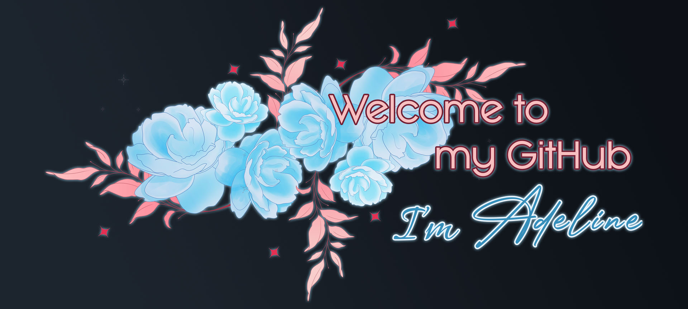

<h1 align='center'> Hello there ! ✨ </h1>

<!--  -->

I’m a software development apprentice currently pursuing a Bachelor’s degree in IT, working on building and delivering applications from scratch to production.

Before transitioning into tech, I worked as a nurse for three years. That experience shaped how I approach work today: structured thinking, prioritization, and responsibility in execution.

Today, I’m focused on backend development and system design, with a strong interest in building reliable, maintainable, and well-structured software.

---

## 🧠 How I Work

I naturally take ownership of the structure and direction of projects when needed.

- I focus on understanding problems before jumping into implementation  
- I design systems with long-term maintainability in mind  
- I set up environments and workflows to make projects reproducible and easier to work on  
- I help structure team efforts: planning, prioritization, and code quality practices  
- I value clarity, documentation, and consistent delivery over quick fixes  

In team settings, I often operate at the intersection of architecture, coordination, and execution.

---

## 🎯 What I’m Building Towards

I aim to grow into a role focused on:

- backend engineering and system architecture  
- designing scalable and maintainable solutions  
- improving development processes and technical foundations  
- contributing to projects where structure and clarity matter as much as code  

I’m still exploring and learning, but I’m particularly drawn to environments where technical rigor and thoughtful design are important.

<!-- ### 🔗 Links -->
## 💬 Contact me
🌍 Marseille, France

    

## 🛠️ Technical Stack
### ⚙️ Environment & Tooling

### 🧠 Backend & Systems

### 🌐 Web Layer

> This stack reflects technologies I use in academic, personal, and professional projects.

___

## 📈 GitHub Stats

  

 

## 🏆 GitHub Profile Trophy

